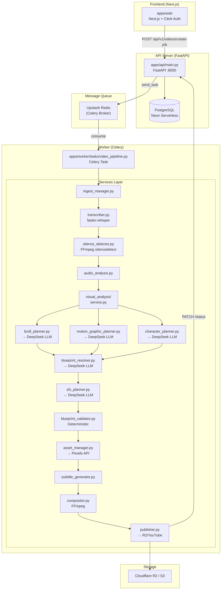

# AI Content Manager — Complete End-to-End Technical Reference

> **Purpose**: This document is your debugging bible. It maps every line of data flow from the moment a user clicks "Create Video" to the final `.mp4` landing in Cloudflare R2. Every service, every LLM call, every FFmpeg command, every file path.

---

## Table of Contents

1. [System Architecture Overview](#1-system-architecture-overview)
2. [The Complete Tech Stack](#2-the-complete-tech-stack)
3. [Step-by-Step: What Happens When a User Submits a Script](#3-step-by-step-what-happens-when-a-user-submits-a-script)
4. [STEP 1 — Job Creation & Dispatch](#step-1--job-creation--dispatch)
5. [STEP 2 — Download & Ingest](#step-2--download--ingest)
6. [STEP 3 — Audio Extraction & Transcription (Speech-to-Text)](#step-3--audio-extraction--transcription)
7. [STEP 4 — Silence Detection & Audio Region Classification](#step-4--silence-detection--audio-region-classification)
8. [STEP 5 — Visual Intelligence Layer](#step-5--visual-intelligence-layer)
9. [STEP 6 — Multi-Agent AI Directors (The Brain)](#step-6--multi-agent-ai-directors-the-brain)
10. [STEP 7 — Master Blueprint Resolver](#step-7--master-blueprint-resolver)
11. [STEP 8 — SFX Planner](#step-8--sfx-planner)
12. [STEP 9 — Blueprint Validator (Safety Net)](#step-9--blueprint-validator-safety-net)
13. [STEP 10 — Asset Sourcing (Pexels API)](#step-10--asset-sourcing-pexels-api)
14. [STEP 11 — Subtitle Generation (ASS Karaoke)](#step-11--subtitle-generation-ass-karaoke)
15. [STEP 12 — FFmpeg Compositor (Final Render)](#step-12--ffmpeg-compositor-final-render)
16. [STEP 13 — Upload & Publish](#step-13--upload--publish)
17. [The Motion Components Package (Future Remotion Engine)](#the-motion-components-package)
18. [Data Schemas & Types Reference](#data-schemas--types-reference)
19. [Common Debugging Scenarios](#common-debugging-scenarios)
20. [Environment Variables Reference](#environment-variables-reference)

---

## 1. System Architecture Overview



---

## 2. The Complete Tech Stack

| Layer | Technology | File Location |
|-------|-----------|---------------|
| **Frontend** | Next.js 15, React, TailwindCSS, Clerk Auth | `apps/web/` |
| **API Server** | FastAPI, SQLModel, Pydantic, Uvicorn | `apps/api/main.py` |
| **Database** | PostgreSQL (Neon Serverless), SQLite (dev) | `apps/api/database.py` |
| **Auth** | Clerk (JWT tokens) | `.env` → `CLERK_SECRET_KEY` |
| **Message Queue** | Celery + Upstash Redis (TLS) | `apps/worker/celery_app.py` |
| **Speech-to-Text** | `faster-whisper` (small model, int8 CPU) | `apps/worker/services/transcriber.py` |
| **Silence Detection** | FFmpeg `silencedetect` filter | `apps/worker/services/silence_detector.py` |
| **Visual Analysis** | OpenCV (frame sampling), MediaPipe (pose) | `apps/worker/services/visual_analysis/` |
| **AI Director LLM** | DeepSeek Chat via OpenRouter API | `apps/worker/services/ai_director.py` |
| **B-Roll Assets** | Pexels Video API (portrait, medium) | `apps/worker/services/asset_manager.py` |
| **Subtitles** | Custom ASS generator (karaoke-style) | `apps/worker/services/subtitle_generator.py` |
| **Video Rendering** | FFmpeg (libx264, AAC, 1080×1920) | `apps/worker/services/compositor.py` |
| **Cloud Storage** | Cloudflare R2 (S3-compatible) / local dev | `apps/worker/services/publisher.py` |
| **Social Publishing** | YouTube Data API v3, Instagram Graph API | `apps/worker/services/publisher.py` |
| **Motion Components** | React + TypeScript (future Remotion engine) | `packages/motion-components/` |

---

## 3. Step-by-Step: What Happens When a User Submits a Script

The entire pipeline is an **8-step Celery task** defined in [`video_pipeline.py`](file:///media/vansh/167267A5726787F7/Coding/Main%20Projects/Ai%20Content%20Manager/apps/worker/tasks/video_pipeline.py). Here is every step with exact file references, data shapes, and debugging tips.

---

### STEP 1 — Job Creation & Dispatch

**Files**: [`apps/api/routers/videos.py`](file:///media/vansh/167267A5726787F7/Coding/Main%20Projects/Ai%20Content%20Manager/apps/api/routers/videos.py), [`apps/api/routers/jobs.py`](file:///media/vansh/167267A5726787F7/Coding/Main%20Projects/Ai%20Content%20Manager/apps/api/routers/jobs.py)

**What happens**:
1. Frontend sends `POST /api/v1/videos/create-job` with:
   ```json
   {
     "title": "My Video",
     "source_url": "http://localhost:8000/api/v1/storage/download?key=raw-uploads/user123/video.mp4",
     "video_type": "talking_head",
     "clerk_id": "user_xyz",
     "settings": {
       "aspect_ratio": "9:16",
       "video_style": "viral",
       "caption_preset": "tiktok_yellow"
     }
   }
   ```
2. API finds or creates a `User` row in PostgreSQL
3. Creates a `VideoJob` row with `status = QUEUED`
4. Calls `dispatch_job_to_celery(job.id)` which sends the Celery task `tasks.process_video_pipeline` to the Redis queue `video_processing_queue`

**Job Status State Machine** (defined in [`models.py`](file:///media/vansh/167267A5726787F7/Coding/Main%20Projects/Ai%20Content%20Manager/apps/api/models.py)):
```
QUEUED → DOWNLOADING → TRANSCRIBING → AI_DIRECTING → RENDERING → PUBLISHING → COMPLETED
                                                                                  ↓
                                                                               FAILED
```

> [!TIP]
> **Debug**: If a job is stuck in `QUEUED`, check Redis connectivity. The Celery client in `jobs.py` line 31 has a fallback that returns a `dev_simulated_*` ID if Redis is down — the job will never execute.

---

### STEP 2 — Download & Ingest

**File**: [`apps/worker/services/ingest_manager.py`](file:///media/vansh/167267A5726787F7/Coding/Main%20Projects/Ai%20Content%20Manager/apps/worker/services/ingest_manager.py)

**Function**: `stage_raw_video(source_url, raw_video_path, temp_dir)`

**What happens**:
1. Checks if `source_url` is a local file path → `shutil.copyfile`
2. Checks if it's a `key=` R2 reference → looks for the file in `media_temp/raw-uploads/...`
3. If HTTP URL → streams download with `requests.get(stream=True)`
4. Validates file is > 1024 bytes (rejects corrupt/empty uploads)

**Output**: `media_temp/{job_uuid}/raw_source.mp4`

> [!WARNING]
> **Common failure**: If the user uploads via presigned URL but the file hasn't finished uploading when the worker starts, `stage_raw_video` gets an empty/partial file. The 1024-byte check catches this.

---

### STEP 3 — Audio Extraction & Transcription

**Files**: [`media_extractor.py`](file:///media/vansh/167267A5726787F7/Coding/Main%20Projects/Ai%20Content%20Manager/apps/worker/services/media_extractor.py), [`transcriber.py`](file:///media/vansh/167267A5726787F7/Coding/Main%20Projects/Ai%20Content%20Manager/apps/worker/services/transcriber.py)

#### 3a. Audio Extraction
```python
extract_audio_track(raw_video_path, extracted_wav_path, sample_rate=16000, channels=1)
```
Uses FFmpeg to extract a 16kHz mono WAV file. This format is required by faster-whisper.

#### 3b. Transcription — faster-whisper

**Model**: `small` (int8 quantized, CPU)  
**NOT using any TTS (text-to-speech)**. This is **STT (speech-to-text)** — it listens to the video audio and converts speech to text.

```python
model.transcribe(
    audio_path,
    word_timestamps=True,    # ← CRITICAL: gives per-word timing
    beam_size=5,
    vad_filter=True,         # Voice Activity Detection enabled
    initial_prompt="This is a video featuring Hindi and English mixed language..."
)
```

**Output — Two things**:

1. **`bracketed_transcript`** (string sent to LLM):
   ```
   ID_01: [00:00.40 - 00:03.20] Hey everyone welcome to my channel
   ID_02: [00:03.80 - 00:07.15] Today we're going to talk about AI
   ID_03: [00:08.00 - 00:12.50] The first thing you need to know is
   ```

2. **`timestamp_map`** (dict — the ground truth):
   ```json
   {
     "ID_01": {
       "start": 0.40,
       "end": 3.20,
       "text": "Hey everyone welcome to my channel",
       "words": [
         {"word": "Hey", "start": 0.40, "end": 0.60, "probability": 0.95},
         {"word": "everyone", "start": 0.62, "end": 1.10, "probability": 0.92},
         ...
       ]
     }
   }
   ```

**Chunking logic** — Words are grouped into chunks when:
- Speech gap > 0.8 seconds
- Sentence-ending punctuation (`.`, `!`, `?`)
- Chunk reaches 18 words

> [!IMPORTANT]
> The `timestamp_map` is the **single source of truth** for all downstream timing. Every `trigger_id` the AI produces (like `ID_03`) maps back to this. If a trigger_id doesn't exist here, the validator rejects it.

---

### STEP 4 — Silence Detection & Audio Region Classification

**Files**: [`silence_detector.py`](file:///media/vansh/167267A5726787F7/Coding/Main%20Projects/Ai%20Content%20Manager/apps/worker/services/silence_detector.py), [`audio_analysis.py`](file:///media/vansh/167267A5726787F7/Coding/Main%20Projects/Ai%20Content%20Manager/apps/worker/services/audio_analysis.py)

#### 4a. Silence Detection
Uses FFmpeg's `silencedetect` audio filter:
```bash
ffmpeg -i audio.wav -af "silencedetect=noise=-35dB:d=0.5" -f null -
```
Parses stderr for `silence_start` / `silence_end` events.

#### 4b. Audio Region Classification
`classify_audio_regions()` takes the entire timeline and labels every moment as one of:
- **`SPEECH`** — Whisper detected words here
- **`SILENCE`** — FFmpeg detected low volume here  
- **`NON_SPEECH_AUDIO`** — Neither speech nor silence (music, ambient noise)

These regions are sent to the AI Director as context so it knows where to place B-roll (ideally during `NON_SPEECH_AUDIO` or `SILENCE` gaps).

---

### STEP 5 — Visual Intelligence Layer

**Files**: [`visual_analysis/service.py`](file:///media/vansh/167267A5726787F7/Coding/Main%20Projects/Ai%20Content%20Manager/apps/worker/services/visual_analysis/service.py), `frame_sampler.py`, `scene_detector.py`, `subject_detector.py`, `composition_analyzer.py`

This runs 4 sub-analyses:

| Sub-step | What it does | Output |
|----------|-------------|--------|
| **Frame Sampler** | Extracts 1 frame/second using FFmpeg | List of `.jpg` frame paths |
| **Scene Detector** | Detects visual scene changes (cuts in the original footage) | `SceneEvent` list with timestamps |
| **Subject Detector** | Uses MediaPipe Pose Landmarker to detect people + bounding boxes | `SubjectEvent` list with `BoundingBox(x,y,w,h)` |
| **Composition Analyzer** | Determines subject position (left/center/right) and safe regions for overlays | `CompositionSegment` list |

**Final output**: `UnifiedAnalysis` Pydantic model:
```python
class UnifiedAnalysis(BaseModel):
    transcript: str                          # The bracketed transcript
    audio_analysis: dict                     # {"regions": [...SPEECH/SILENCE...]}
    visual_analysis: UnifiedVisualTimeline   # scenes, subjects, composition
```

This entire object is serialized to JSON and sent to every AI agent.

---

### STEP 6 — Multi-Agent AI Directors (The Brain)

**Files**: [`ai_director.py`](file:///media/vansh/167267A5726787F7/Coding/Main%20Projects/Ai%20Content%20Manager/apps/worker/services/ai_director.py), [`broll_planner.py`](file:///media/vansh/167267A5726787F7/Coding/Main%20Projects/Ai%20Content%20Manager/apps/worker/services/broll_planner.py), [`motion_graphic_planner.py`](file:///media/vansh/167267A5726787F7/Coding/Main%20Projects/Ai%20Content%20Manager/apps/worker/services/motion_graphic_planner.py), [`character_planner.py`](file:///media/vansh/167267A5726787F7/Coding/Main%20Projects/Ai%20Content%20Manager/apps/worker/services/character_planner.py)

**LLM Used**: DeepSeek Chat (via OpenRouter API or direct DeepSeek API)
- **OpenRouter key**: `OPENROUTER_API_KEY` → model `deepseek/deepseek-chat`
- **Direct DeepSeek key**: `DEEPSEEK_API_KEY` → model `deepseek-chat`
- **Temperature**: `0.3` (low creativity, more predictable)
- **Response format**: `json_object` (forced JSON output)

#### The 3 agents run IN PARALLEL using `ThreadPoolExecutor(max_workers=3)`:

```python
with concurrent.futures.ThreadPoolExecutor(max_workers=3) as executor:
    future_broll = executor.submit(generate_broll_plan, unified_json_str)
    future_mg    = executor.submit(generate_motion_graphics_plan, unified_json_str)
    future_char  = executor.submit(generate_character_plan, unified_json_str)
```

#### Agent 1: B-Roll & Cut Planner
**Allowed actions**: `cut`, `b_roll`
- `cut`: Remove mistakes/long pauses. Provides `start` + `end` timestamps.
- `b_roll`: Overlay stock footage. Provides `trigger_id` + `search_query` + `reason`.

#### Agent 2: Motion Graphics Planner
**Allowed actions**: `motion_graphics`, `zoom_in`
- `motion_graphics`: Text overlay for statistics/quotes. Provides `trigger_id` + `motion_graphics_text`.
- `zoom_in`: Camera punch-in at punchlines. Provides `trigger_id`.

#### Agent 3: Character Planner
**Allowed actions**: `character`
- `character`: 2D character animation overlay. Provides `trigger_id` + `character_action` (surprised/explaining/pointing).

#### Each agent returns an `EditList`:
```python
class EditDecision(BaseModel):
    action: Literal["cut", "b_roll", "zoom_in", "sfx", "motion_graphics", "character"]
    trigger_id: Optional[str]       # e.g., "ID_03"
    start: Optional[float]          # For cuts only
    end: Optional[float]            # For cuts only
    search_query: Optional[str]     # For b_roll: Pexels search keywords
    sound_effect: Optional[str]     # For sfx: "whoosh", "pop", "ding"
    motion_graphics_text: Optional[str]
    character_action: Optional[str]
    reason: Optional[str]           # Why this edit was made

class EditList(BaseModel):
    edits: List[EditDecision]
```

> [!CAUTION]
> **LLM Hallucination Risk**: The AI might output a `trigger_id` like `ID_99` that doesn't exist in the `timestamp_map`. The Blueprint Validator (Step 9) catches this. But if the LLM returns malformed JSON, `_call_llm()` will crash with a `json.JSONDecodeError`.

---

### STEP 7 — Master Blueprint Resolver

**File**: [`blueprint_resolver.py`](file:///media/vansh/167267A5726787F7/Coding/Main%20Projects/Ai%20Content%20Manager/apps/worker/services/blueprint_resolver.py)

**What it does**: Takes the 3 independent agent plans and **merges them into one cohesive plan**, resolving conflicts.

**Conflict resolution rules** (enforced by the LLM prompt):
- If B-roll AND motion graphics target the **same `trigger_id`**:
  - Visual/real-world concept → keep `b_roll`
  - Statistic/quote/text → keep `motion_graphics`
- Ensures "breathing room" between visual events
- Does NOT add new events — only selects/deduplicates from the 3 plans

**Input**: The unified analysis JSON + all 3 agent plans
**Output**: A single merged `EditList`

This is another LLM call (DeepSeek, same config).

---

### STEP 8 — SFX Planner

**File**: [`sfx_planner.py`](file:///media/vansh/167267A5726787F7/Coding/Main%20Projects/Ai%20Content%20Manager/apps/worker/services/sfx_planner.py)

**What it does**: Reads the finalized visual blueprint and adds `sfx` actions that complement the visuals.

**Rules** (from the system prompt):
- B-roll transition → `whoosh` or `swoosh`
- Motion graphics popup → `pop` or `ding`
- Character surprised → `gasp` or `boing`
- Don't overload with sounds

**Output**: The resolved visual blueprint + SFX edits combined into one `EditList`:
```python
combined_edits = resolved_visual_blueprint.edits + sfx_only_plan.edits
return EditList(edits=combined_edits)
```

> [!NOTE]
> SFX is currently **planned but not rendered** by the compositor. The `sfx` action is in the edit list but `compositor.py` doesn't have a sound effect overlay implementation yet. It's a placeholder for future work.

---

### STEP 9 — Blueprint Validator (Safety Net)

**File**: [`blueprint_validator.py`](file:///media/vansh/167267A5726787F7/Coding/Main%20Projects/Ai%20Content%20Manager/apps/worker/services/blueprint_validator.py)

**This is the most important safety layer.** It's 100% deterministic — no LLM involved. It catches every bad decision the AI made.

**Validation checks**:

| Check | Applies To | What It Catches |
|-------|-----------|----------------|
| Missing `action` field | All | Malformed JSON from LLM |
| Missing `start`/`end` | `cut` | LLM forgot timestamps |
| Timestamps outside video | `cut`, all | `start: -5.0` or `end: 999.0` |
| `end <= start` | All | Inverted ranges |
| Cut too short (<0.3s) | `cut` | Micro-cuts that cause glitches |
| Missing `trigger_id` | Non-cut | LLM forgot to reference a chunk |
| `trigger_id` not in `timestamp_map` | Non-cut | **LLM hallucinated a chunk ID** |
| B-roll count limit (max 3) | `b_roll` | Too many B-roll inserts |
| B-roll too short (<2.5s) | `b_roll` | Clip too brief to be useful |
| B-roll too long (>6.0s) | `b_roll` | Warning only (chunk duration is from transcriber) |
| B-roll budget exhausted (>40% of video) | `b_roll` | Too much B-roll total |
| B-roll overlaps with existing B-roll | `b_roll` | Two B-rolls at same time |
| B-roll spacing too close (<5.0s apart) | `b_roll` | B-rolls back-to-back |
| Missing `search_query` | `b_roll` | Can't search Pexels |
| Missing `reason` | `b_roll` | Unjustified decision |

**Config values** from [`editing_config.py`](file:///media/vansh/167267A5726787F7/Coding/Main%20Projects/Ai%20Content%20Manager/apps/worker/services/editing_config.py):
```python
MAX_BROLL_COUNT = 3
MAX_BROLL_DURATION_RATIO = 0.40      # 40% of video max
MIN_BROLL_DURATION_SEC = 2.5
MAX_BROLL_DURATION_SEC = 6.0
MIN_BROLL_SPACING_SEC = 5.0
BROLL_REASON_REQUIRED = True
MIN_CUT_DURATION_SEC = 0.3
MAX_AV_SYNC_TOLERANCE_SEC = 1.0
MIN_AUDIO_DURATION_RATIO = 0.8
```

**Output**: `(validated_edits, ValidationReport)` — only the edits that passed.

---

### STEP 10 — Asset Sourcing (Pexels API)

**File**: [`asset_manager.py`](file:///media/vansh/167267A5726787F7/Coding/Main%20Projects/Ai%20Content%20Manager/apps/worker/services/asset_manager.py)

For every validated `b_roll` edit:
1. Takes the `search_query` (e.g., `"artificial intelligence technology"`)
2. Calls Pexels Video API: `GET https://api.pexels.com/videos/search?query=...&orientation=portrait&per_page=3&size=medium`
3. Selects the highest-resolution MP4 file from the first result
4. Downloads to `media_temp/{job_uuid}/assets/broll_{trigger_id}.mp4`

**Output**: `broll_map` dict: `{"ID_03": "/path/to/broll_ID_03.mp4", ...}`

> [!WARNING]
> If `PEXELS_API_KEY` is missing, the function raises `ValueError`. If the search returns no results, it raises `RuntimeError`. Both crash the pipeline.

---

### STEP 11 — Subtitle Generation (ASS Karaoke)

**File**: [`subtitle_generator.py`](file:///media/vansh/167267A5726787F7/Coding/Main%20Projects/Ai%20Content%20Manager/apps/worker/services/subtitle_generator.py)

Generates `.ass` (Advanced SubStation Alpha) subtitles with **word-by-word highlighting** — the TikTok/YouTube Shorts karaoke effect.

**How it works**:
1. For each chunk in `timestamp_map`:
   - Skip if the chunk is inside a `cut` interval
   - For each **word** in the chunk, create a separate subtitle event where **that word is highlighted yellow** and all other words are white
2. Time mapping: Adjusts all timestamps to account for removed `cut` segments (the `_map_time()` function subtracts the duration of all cuts that occurred before that timestamp)

**Style**: Arial 74pt, white text, yellow highlight (`&H0000FFFF`), black outline, positioned at bottom-center of 1080×1920 canvas.

**Caption presets** (from job settings):
- `tiktok_yellow` → `&H0000FFFF` (yellow highlight)
- `neon_cyber` → `&H00FFFF00` (cyan highlight)
- `modern_clean` → `&H00E0E0E0` (light gray highlight)
- `boxed_pill` → `&H0000A5FF` (orange highlight)

---

### STEP 12 — FFmpeg Compositor (Final Render)

**File**: [`compositor.py`](file:///media/vansh/167267A5726787F7/Coding/Main%20Projects/Ai%20Content%20Manager/apps/worker/services/compositor.py) (750 lines — the biggest service)

This is the core rendering engine. It assembles the final video in 3 FFmpeg passes:

#### Pass A: Extract & Process Segments

For each "kept" segment (not cut), FFmpeg extracts it with effects applied:

**Normal segment** (no B-roll, no zoom):
```bash
ffmpeg -y -i raw_source.mp4 \
  -ss 3.200 -t 4.150 \
  -vf "scale=1080:1920:force_original_aspect_ratio=increase,crop=1080:1920" \
  -r 30 -c:v libx264 -preset fast -crf 23 \
  -c:a aac -b:a 192k -pix_fmt yuv420p \
  seg_001.mp4
```

**B-Roll segment** (video replaced, audio kept):
```bash
ffmpeg -y \
  -i raw_source.mp4 \              # Input 0: AUDIO source
  -an -i broll_ID_03.mp4 \         # Input 1: VIDEO source (audio discarded with -an)
  -filter_complex "[1:v]fps=30,scale=1080:1920:...,crop=1080:1920,...[vout]" \
  -map "[vout]" -map "0:a" \       # Video from B-roll, Audio from original
  -ss 8.000 -t 4.500 \
  seg_003.mp4
```

> [!IMPORTANT]
> **Audio Ownership Rule**: The original video's audio is ALWAYS the primary audio. B-roll replaces ONLY the visual layer. B-roll audio is explicitly discarded with `-an` on the input. This prevents the common bug where B-roll brings its own background music into the final video.

**Zoom segment** (1.15x crop zoom):
```bash
-vf "scale=1242:2208:force_original_aspect_ratio=increase,crop=1080:1920"
```
(1080 × 1.15 = 1242, effectively a 15% zoom)

#### Pass B: Concatenate Segments

```bash
ffmpeg -y -f concat -safe 0 -i concat_list.txt -c copy concatenated.mp4
```

`concat_list.txt`:
```
file '/path/to/seg_000.mp4'
file '/path/to/seg_001.mp4'
file '/path/to/seg_002.mp4'
```

#### Pass C: Burn Subtitles

```bash
ffmpeg -y -i concatenated.mp4 \
  -vf "subtitles=/path/to/subtitles.ass" \
  -c:v libx264 -preset fast -crf 23 \
  -c:a copy -pix_fmt yuv420p \
  final_rendered.mp4
```

#### Post-Render Validation

After rendering, the compositor validates:
- Output file exists and > 1024 bytes
- Has a video stream
- Has an audio stream (if source had audio)
- Audio/video duration difference < 1.0s
- Audio duration is > 80% of video duration

---

### STEP 13 — Upload & Publish

**File**: [`publisher.py`](file:///media/vansh/167267A5726787F7/Coding/Main%20Projects/Ai%20Content%20Manager/apps/worker/services/publisher.py)

1. **Upload to Cloudflare R2** (if credentials configured):
   ```
   s3://ai-video-manager-uploads/rendered-exports/{user_id}/{job_id}_final.mp4
   ```
   
2. **Local dev fallback**: Copies to `media_temp/rendered-exports/...` and returns `http://localhost:8000/api/v1/storage/download?key=...`

3. **YouTube Shorts publish** (if OAuth token provided):
   - Creates a resumable upload via YouTube Data API v3
   - Sets `privacyStatus: "public"`, category 22 (People & Blogs)
   - Tags: `shorts, ai, viral, video`

4. **Instagram Reels publish** (if OAuth token provided):
   - Creates media container via Instagram Graph API
   - Publishes via `media_publish` endpoint

5. Updates job status to `COMPLETED` with the final URL, or `FAILED` with the error stack trace.

---

## The Motion Components Package

**Location**: [`packages/motion-components/`](file:///media/vansh/167267A5726787F7/Coding/Main%20Projects/Ai%20Content%20Manager/packages/motion-components/)

This is a **future** React/Remotion-based rendering engine (not yet integrated into the pipeline). Currently, the pipeline uses FFmpeg directly. This package will eventually replace the FFmpeg compositor for more advanced animations.

**Module structure** (23 modules):

| Module | Purpose |
|--------|---------|
| `animations/` | FadeIn, SlideIn, Draw, Morph, Stagger, Pop effects |
| `attention/` | Viewer attention sequencing (blur background, highlight elements) |
| `character/` | 2D character overlays with emotion states |
| `charts/` | Animated bar/line/pie charts |
| `devices/` | Phone/laptop mockup frames |
| `effects/` | Visual effects (particles, glitch, etc.) |
| `elements/` | Base UI elements (text blocks, images, buttons) |
| `layout/` | Anchor points, safe zones, bounding boxes |
| `media/` | Image/video/audio/caption resolution |
| `placement/` | Auto-positioning, collision avoidance |
| `relationships/` | Relative positioning (element A "below" element B) |
| `scene/` | Scene graph resolution (the main orchestrator) |
| `templates/` | Pre-built scene layouts (SplitScreen, StepByStep, Timeline) |
| `themes/` | Design tokens, color palettes |
| `transitions/` | Crossfade, wipe, slide transitions between scenes |
| `typography/` | Font resolution, text measurement, fitting |
| `validation/` | Composition diagnostics and safety checks |

---

## Data Schemas & Types Reference

### `EditDecision` (what the AI outputs)
```typescript
{
  action: "cut" | "b_roll" | "zoom_in" | "sfx" | "motion_graphics" | "character",
  trigger_id?: "ID_01",        // References timestamp_map key
  start?: 5.2,                 // Cut start time (seconds)
  end?: 8.7,                   // Cut end time (seconds)
  search_query?: "technology", // Pexels search for b_roll
  sound_effect?: "whoosh",     // SFX name
  motion_graphics_text?: "50% faster!",
  character_action?: "surprised",
  reason?: "Emphasizes the key stat"
}
```

### `timestamp_map` (ground truth timing)
```typescript
{
  "ID_01": {
    start: 0.40,
    end: 3.20,
    text: "Hey everyone welcome to my channel",
    words: [
      {word: "Hey", start: 0.40, end: 0.60, probability: 0.95},
      {word: "everyone", start: 0.62, end: 1.10, probability: 0.92},
      // ...
    ]
  }
}
```

### `VideoJob` (database model)
```python
id: UUID
user_id: UUID
title: str
source_url: str          # Where the raw video is stored
rendered_url: str         # Where the final video is stored
video_type: "talking_head" | "faceless_short"
status: "QUEUED" | "DOWNLOADING" | ... | "COMPLETED" | "FAILED"
edit_decision_list: str   # JSON blob of the entire pipeline output
error_log: str            # Stack trace if FAILED
```

---

## Common Debugging Scenarios

### 1. "Job stuck in QUEUED"
- **Check**: Is Redis/Celery running? `celery -A celery_app worker --loglevel=info`
- **Check**: Look at `jobs.py` line 76 — if you see `dev_simulated_*` in logs, Redis connection failed
- **Fix**: Verify `REDIS_URL` in `.env`, ensure Upstash Redis is accessible

### 2. "Transcription is empty or garbage"
- **Check**: Is the audio actually extractable? `ffmpeg -i video.mp4 -vn audio.wav`
- **Check**: Is the audio in a language Whisper supports?
- **Fix**: The `initial_prompt` in `transcriber.py:85` is tuned for Hindi+English. Change it for other languages

### 3. "LLM returns malformed JSON"
- **Symptom**: `json.JSONDecodeError` in `ai_director.py:71`
- **Check**: The LLM response might start with `` ```json `` — there's a strip at line 68-69
- **Fix**: If it's a persistent issue, try lowering `temperature` or using a different model via OpenRouter

### 4. "All B-roll edits are rejected by validator"
- **Check**: Look at the `ValidationReport` in the logs
- **Common causes**:
  - `trigger_id 'ID_XX' not found in timestamp_map` → LLM hallucinated
  - `B-roll budget exhausted` → increase `MAX_BROLL_DURATION_RATIO` in `editing_config.py`
  - `B-roll spacing too close` → reduce `MIN_BROLL_SPACING_SEC`

### 5. "Final video has no audio"
- **Symptom**: `AUDIO FAILURE: Source video had audio but final render has NO audio stream`
- **Check**: B-roll overlay might have replaced the audio. The `-map "0:a"` flag in compositor should prevent this
- **Fix**: Check `compositor.py` line 514-515 — the explicit `-map "0:a"` must be present

### 6. "Subtitles are out of sync after cuts"
- **Check**: The `_map_time()` function in `subtitle_generator.py:45-55` handles time remapping after cuts
- **Common bug**: If a cut interval overlaps partially with a word, the subtitle timing drifts
- **Fix**: Verify `cut_intervals` are correctly sorted and non-overlapping

### 7. "Pexels returns no results"
- **Symptom**: `RuntimeError: No videos found on Pexels for query: ...`
- **Check**: The `search_query` might be too specific or in a non-English language
- **Fix**: The LLM prompt instructs it to use English keywords, but sometimes it doesn't comply

### 8. "FFmpeg segment fails"
- **Symptom**: `RuntimeError: FFmpeg failed for 'segment_ID_03'`
- **Check**: Look at the stderr preview in the logs (first 1500 chars)
- **Common cause**: B-roll file is corrupt or has incompatible codec
- **Resilience**: The compositor automatically retries B-roll segments without the overlay (line 558-576)

---

## Environment Variables Reference

| Variable | Used By | Purpose |
|----------|---------|---------|
| `DATABASE_URL` | API, Worker | PostgreSQL connection string |
| `REDIS_URL` | API, Worker | Celery broker (Upstash Redis with TLS) |
| `DEEPSEEK_API_KEY` | Worker | Direct DeepSeek API for AI Director |
| `OPENROUTER_API_KEY` | Worker | OpenRouter proxy for DeepSeek (preferred) |
| `PEXELS_API_KEY` | Worker | B-roll stock video downloads |
| `R2_ACCESS_KEY_ID` | API, Worker | Cloudflare R2 upload credentials |
| `R2_SECRET_ACCESS_KEY` | API, Worker | Cloudflare R2 upload credentials |
| `R2_BUCKET_NAME` | API, Worker | Target bucket for uploads |
| `R2_ENDPOINT_URL` | API, Worker | R2 endpoint (auto-generated from account ID if missing) |
| `CLERK_SECRET_KEY` | API | User authentication |
| `GEMINI_API_KEY` | Worker | (Reserved, not currently used in pipeline) |
| `HUGGING_FACE_API_KEY` | Worker | (Reserved for image generation) |
| `GNEWS_API_KEY` | Worker | (Reserved for news content) |

---

## Summary: The 5 LLM Calls in Order

| # | Agent | File | What It Decides |
|---|-------|------|----------------|
| 1 | B-Roll Planner | `broll_planner.py` | What to cut, where to overlay stock footage |
| 2 | Motion Graphics Planner | `motion_graphic_planner.py` | Where to show text overlays and zoom-ins |
| 3 | Character Planner | `character_planner.py` | Where to place 2D character reactions |
| 4 | Master Blueprint Resolver | `blueprint_resolver.py` | Merge & deduplicate the 3 plans |
| 5 | SFX Planner | `sfx_planner.py` | Add sound effects to accompany visuals |

Agents 1-3 run **in parallel**. Agents 4-5 run **sequentially** after.

All 5 calls go to **DeepSeek Chat** via OpenRouter at `temperature=0.3` with forced JSON output.

> [!NOTE]
> There is **no text-to-speech (TTS)** anywhere in this pipeline. The system takes an **existing video with spoken audio**, transcribes it (STT), and then edits the video intelligently. It does NOT generate voiceovers from scripts.
