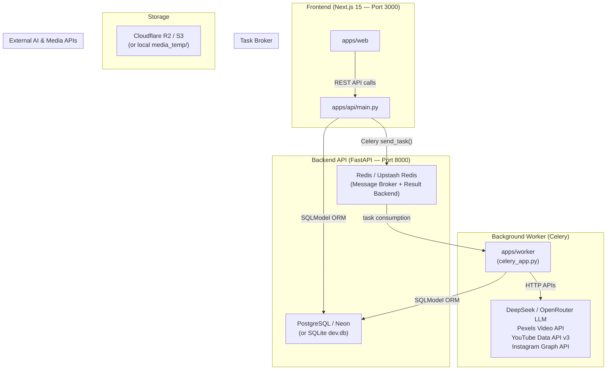
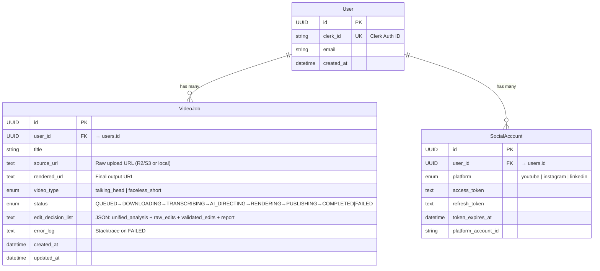
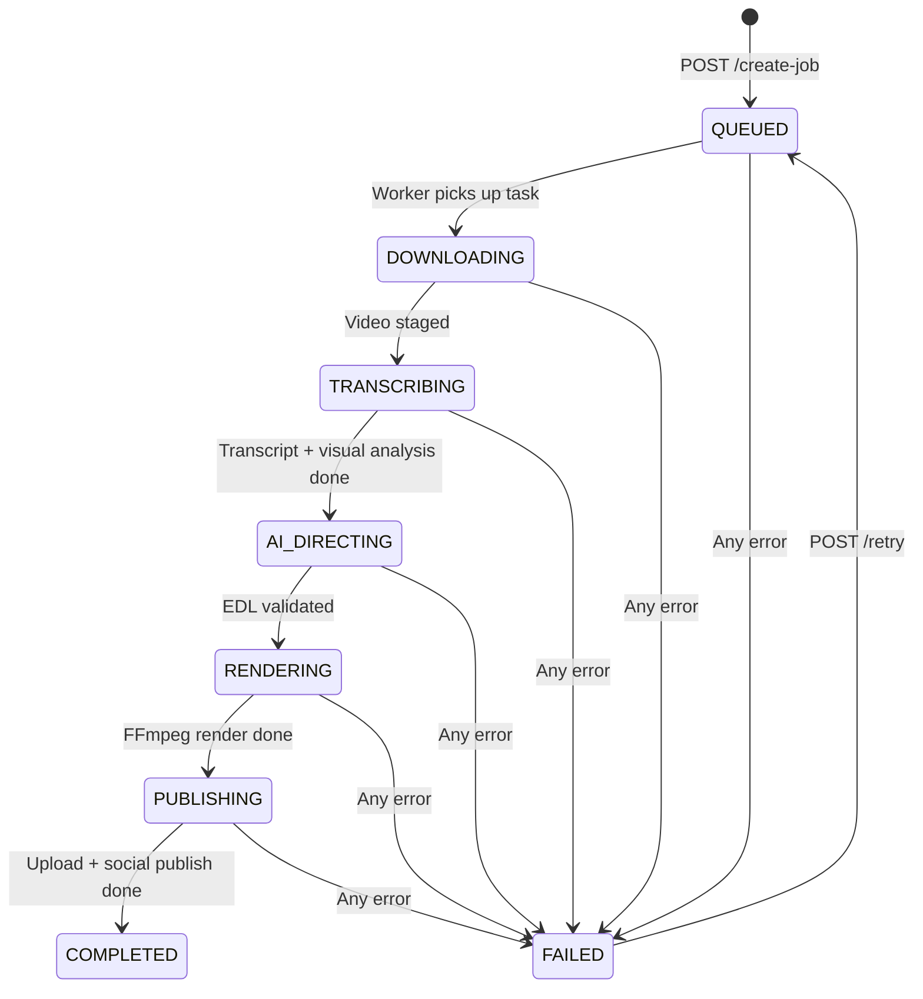
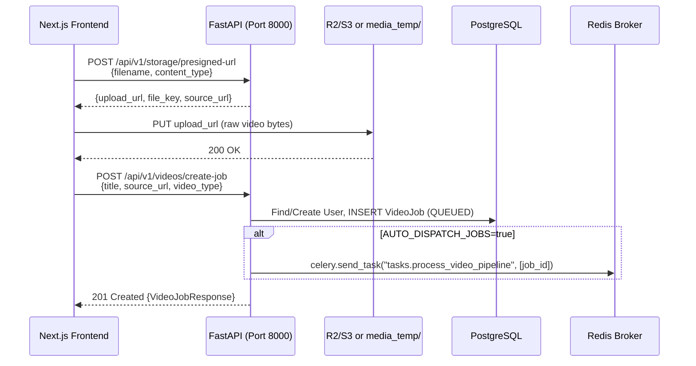
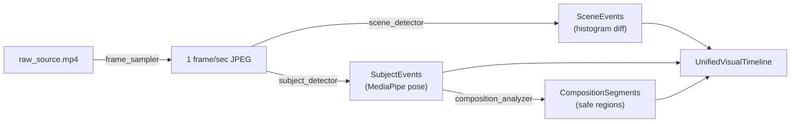
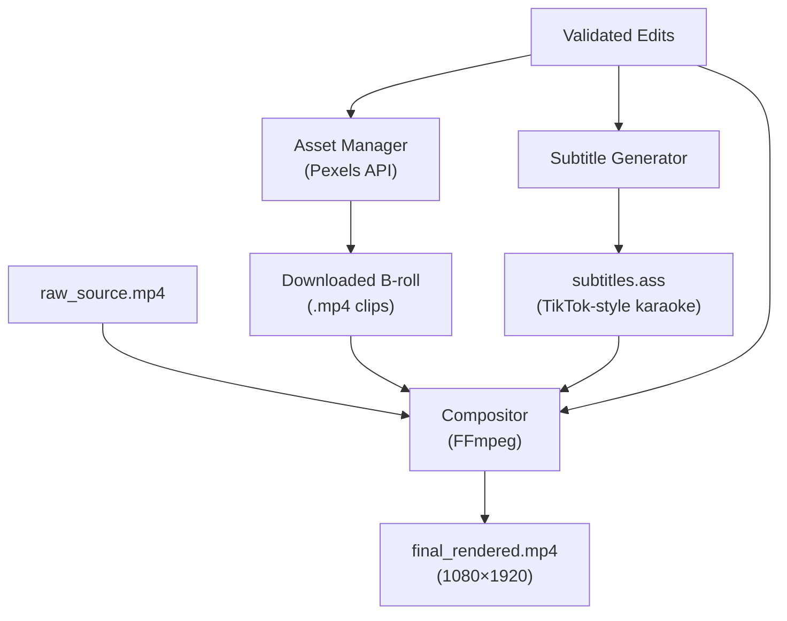

# AI Content Manager — Complete System Architecture & Data Flow

> **Purpose**: Comprehensive debugging reference for the entire monorepo. Covers every file, every service, every data flow, and every connection point.

---

## 1. High-Level Architecture



---

## 2. Monorepo Structure — File Map

```
ai-content-manager/                     ← Root (npm workspaces monorepo)
├── .env                                ← SHARED env vars (DB, Redis, AI keys, storage)
├── package.json                        ← Workspaces: apps/*, packages/*
├── docker-compose.yml                  ← PostgreSQL 16 + Redis 7 containers
│
├── apps/
│   ├── api/                            ← FastAPI backend (Python)
│   │   ├── main.py                     ← App entrypoint, CORS, router registration
│   │   ├── config.py                   ← Pydantic Settings (env loading)
│   │   ├── database.py                 ← SQLModel engine + session factory
│   │   ├── models.py                   ← DB models (User, SocialAccount, VideoJob)
│   │   ├── storage.py                  ← S3/R2 presigned URL generator
│   │   ├── routers/
│   │   │   ├── videos.py               ← CRUD: create-job, list, get, update status, delete
│   │   │   ├── jobs.py                 ← Queue: dispatch, retry, status, list by filter
│   │   │   └── storage.py             ← presigned-url, dev-upload, dev-download
│   │   ├── alembic/                    ← DB migrations (Alembic)
│   │   ├── requirements.txt
│   │   └── dev.db                      ← Local SQLite fallback
│   │
│   ├── web/                            ← Next.js 15 frontend (TypeScript)
│   │   ├── app/
│   │   │   ├── page.tsx                ← Landing page (hero + feature highlights)
│   │   │   ├── layout.tsx              ← Root layout (Geist font, AuthProvider)
│   │   │   ├── globals.css             ← Tailwind + custom styles
│   │   │   └── dashboard/
│   │   │       ├── page.tsx            ← Dashboard overview (stats, state machine)
│   │   │       ├── layout.tsx          ← Dashboard sidebar layout
│   │   │       ├── editor/             ← Advanced Video Editor UI
│   │   │       │   ├── page.tsx
│   │   │       │   └── [id]/page.tsx   ← Dynamic editor route for specific jobs
│   │   │       ├── videos/             ← Video management page
│   │   │       ├── queue/              ← Queue monitoring page
│   │   │       ├── socials/            ← Social accounts page
│   │   │       └── settings/           ← Settings page
│   │   ├── components/
│   │   │   ├── AuthProvider.tsx         ← Clerk auth wrapper
│   │   │   ├── VideoUploadModal.tsx     ← Upload flow UI (presign → PUT → create-job)
│   │   │   ├── VideoDetailModal.tsx     ← Job detail viewer (status, EDL, errors)
│   │   │   └── editor/                  ← Advanced Editor Components
│   │   │       ├── TimelineContainer.tsx
│   │   │       ├── PlayerMonitor.tsx
│   │   │       ├── InspectorPanel.tsx
│   │   │       ├── MediaDrawer.tsx
│   │   │       ├── ClipFilmstrip.tsx
│   │   │       └── TransformableOverlay.tsx
│   │   └── lib/
│   │       ├── utils.ts                 ← cn() class merge helper
│   │       ├── idb.ts                   ← IndexedDB helpers for local browser caching
│   │       ├── keyframes.ts             ← Animation / timeline keyframe logic
│   │       ├── timeline-types.ts        ← Types for editor timeline blocks
│   │       └── stores/
│   │           └── useTimelineStore.ts  ← Zustand global store for editor state
│   │
│   └── worker/                         ← Celery background worker (Python)
│       ├── celery_app.py               ← Celery instance (broker=Redis, SSL config)
│       ├── config.py                   ← WorkerSettings + DB engine + session factory
│       ├── worker_logger.py            ← Pretty-print pipeline logger
│       ├── tasks/
│       │   └── video_pipeline.py       ← MASTER TASK: process_video_pipeline()
│       ├── services/
│       │   ├── media_extractor.py      ← FFmpeg audio extraction (video → 16kHz WAV)
│       │   ├── transcriber.py          ← faster-whisper STT + bracket compression
│       │   ├── silence_detector.py     ← FFmpeg silencedetect filter
│       │   ├── audio_analysis.py       ← Unified audio region classifier
│       │   ├── visual_analysis/        ← Visual Intelligence Layer
│       │   │   ├── service.py          ← Orchestrator (frame → scene → subject → composition)
│       │   │   ├── schemas.py          ← Pydantic models (UnifiedAnalysis, etc.)
│       │   │   ├── frame_sampler.py    ← Extract 1 frame/sec via FFmpeg
│       │   │   ├── scene_detector.py   ← Histogram-based scene change detection
│       │   │   ├── subject_detector.py ← MediaPipe pose landmark detection
│       │   │   └── composition_analyzer.py ← Subject position + safe region analysis
│       │   ├── ai_director.py          ← LLM call (DeepSeek/OpenRouter) → EditDecisionList
│       │   ├── blueprint_validator.py  ← Deterministic guardrails (budgets, overlaps)
│       │   ├── editing_config.py       ← Centralized editing limits (singleton)
│       │   ├── asset_manager.py        ← Pexels Video API → download B-roll clips
│       │   ├── subtitle_generator.py   ← Word-level .ass subtitle generation
│       │   ├── compositor.py           ← FFmpeg: cuts + B-roll + zoom + subtitles → 1080×1920
│       │   └── publisher.py            ← Upload to R2/S3 + YouTube Shorts + IG Reels
│       └── tests/                      ← Unit tests
│
├── packages/
│   └── shared-types/
│       └── src/index.ts                ← TypeScript types mirroring Python models
│
├── media_temp/                         ← Local file storage (dev-mode uploads & renders)
└── video_pipeline_flow.md              ← Pipeline documentation
```

---

## 3. Database Schema (SQLModel / PostgreSQL)



### VideoJob Status State Machine



---

## 4. Complete Data Flow — End to End

### Phase 0: Video Upload (Frontend → API → Storage)



> [!IMPORTANT]
> **Dev Mode**: When R2 credentials are empty, presigned URLs point to `localhost:8000/api/v1/storage/dev-upload` and files are stored in `media_temp/raw-uploads/`.

### Phase 1: Download & Ingest (Worker Step 1)

| What happens | File | Key function |
|---|---|---|
| Worker receives `job_id` from Redis | [video_pipeline.py](file:///media/vansh/167267A5726787F7/Coding/Main%20Projects/Ai%20Content%20Manager/apps/worker/tasks/video_pipeline.py#L34-L40) | `process_video_pipeline()` |
| Fetches `VideoJob` from DB | [video_pipeline.py](file:///media/vansh/167267A5726787F7/Coding/Main%20Projects/Ai%20Content%20Manager/apps/worker/tasks/video_pipeline.py#L49-L53) | `session.get(VideoJob, job_uuid)` |
| Sets status → `DOWNLOADING` | [video_pipeline.py](file:///media/vansh/167267A5726787F7/Coding/Main%20Projects/Ai%20Content%20Manager/apps/worker/tasks/video_pipeline.py#L83-L90) | DB update, then `session.close()` |
| Stages video: local path → `raw_source.mp4` | [video_pipeline.py](file:///media/vansh/167267A5726787F7/Coding/Main%20Projects/Ai%20Content%20Manager/apps/worker/tasks/video_pipeline.py#L92-L141) | `shutil.copyfile()` or `requests.get()` stream |
| Validates file size ≥ 1KB | [video_pipeline.py](file:///media/vansh/167267A5726787F7/Coding/Main%20Projects/Ai%20Content%20Manager/apps/worker/tasks/video_pipeline.py#L144-L150) | Raises `ValueError` if stub |

> [!TIP]
> **Debugging downloads**: The worker tries 3 strategies to stage the video:
> 1. Direct local path (`os.path.exists(source_url)`)
> 2. Parse `key=` from dev-mode URL → look up in `media_temp/`
> 3. HTTP GET streaming download with retry loop

### Phase 2: Audio Extraction + Transcription (Worker Step 2)

```mermaid
flowchart LR
    A["raw_source.mp4"] -->|FFmpeg| B["extracted_audio.wav\n(16kHz mono PCM)"]
    B -->|faster-whisper| C["Bracketed Transcript\n+ timestamp_map"]
    B -->|FFmpeg silencedetect| D["Silence Intervals"]
    C -->|word intervals| E["Speech Intervals"]
    D & E -->|classify_audio_regions()| F["Unified Audio Regions\n[SPEECH|SILENCE|NON_SPEECH_AUDIO]"]
```

| Step | Service File | Key Function | Output |
|---|---|---|---|
| 2a. Extract audio | [media_extractor.py](file:///media/vansh/167267A5726787F7/Coding/Main%20Projects/Ai%20Content%20Manager/apps/worker/services/media_extractor.py) | `extract_audio_track()` | `extracted_audio.wav` |
| 2b. Transcribe | [transcriber.py](file:///media/vansh/167267A5726787F7/Coding/Main%20Projects/Ai%20Content%20Manager/apps/worker/services/transcriber.py) | `transcribe_and_compress()` | `bracketed_transcript` (str), `timestamp_map` (dict) |
| 2c. Detect silences | [silence_detector.py](file:///media/vansh/167267A5726787F7/Coding/Main%20Projects/Ai%20Content%20Manager/apps/worker/services/silence_detector.py) | `detect_silences()` | `[{start, end, duration}]` |
| 2d. Classify regions | [audio_analysis.py](file:///media/vansh/167267A5726787F7/Coding/Main%20Projects/Ai%20Content%20Manager/apps/worker/services/audio_analysis.py) | `classify_audio_regions()` | `[{start, end, type}]` |

**`timestamp_map` structure** (critical for downstream):
```json
{
  "ID_01": {
    "start": 0.42,
    "end": 3.18,
    "text": "Hey guys welcome to this video",
    "words": [
      {"word": "Hey", "start": 0.42, "end": 0.68, "probability": 0.95},
      {"word": "guys", "start": 0.70, "end": 1.02, "probability": 0.92}
    ]
  },
  "ID_02": { ... }
}
```

**`bracketed_transcript`** format (sent to LLM):
```
ID_01: [00:00.42 - 00:03.18] Hey guys welcome to this video
ID_02: [00:03.50 - 00:06.22] today we're going to talk about...
```

### Phase 3: Visual Analysis (Worker Step 2.5)



| Module | File | Purpose |
|---|---|---|
| Frame Sampler | [frame_sampler.py](file:///media/vansh/167267A5726787F7/Coding/Main%20Projects/Ai%20Content%20Manager/apps/worker/services/visual_analysis/frame_sampler.py) | Extract JPEG frames at 1fps using FFmpeg |
| Scene Detector | [scene_detector.py](file:///media/vansh/167267A5726787F7/Coding/Main%20Projects/Ai%20Content%20Manager/apps/worker/services/visual_analysis/scene_detector.py) | Histogram comparison for scene changes |
| Subject Detector | [subject_detector.py](file:///media/vansh/167267A5726787F7/Coding/Main%20Projects/Ai%20Content%20Manager/apps/worker/services/visual_analysis/subject_detector.py) | MediaPipe Pose Landmarker (bounding boxes) |
| Composition Analyzer | [composition_analyzer.py](file:///media/vansh/167267A5726787F7/Coding/Main%20Projects/Ai%20Content%20Manager/apps/worker/services/visual_analysis/composition_analyzer.py) | Subject position + safe overlay regions |

**`UnifiedAnalysis`** (the complete context sent to the AI Director):
```python
UnifiedAnalysis(
    transcript="ID_01: [00:00.42 - 00:03.18] Hey guys...",
    audio_analysis={"regions": [{"start": 0.0, "end": 0.42, "type": "NON_SPEECH_AUDIO"}, ...]},
    visual_analysis=UnifiedVisualTimeline(
        video_id="...",
        scenes=[SceneEvent(timestamp=5.0, confidence=0.8)],
        subjects=[SubjectEvent(start=0.0, end=30.0, bounding_box=...)],
        composition_segments=[CompositionSegment(safe_regions=["top_third", "bottom_right"])],
    )
)
```

### Phase 4: AI Director + Blueprint Validation (Worker Steps 3-4)

```mermaid
flowchart LR
    A["UnifiedAnalysis JSON"] -->|"OpenAI SDK\n(DeepSeek/OpenRouter)"| B["Raw EditDecisionList"]
    B -->|validate_blueprint()| C["Validated Edits"]
    B -->|rejected decisions| D["Discarded + Logged"]
```

| Step | Service File | Key Function | Details |
|---|---|---|---|
| AI Director | [ai_director.py](file:///media/vansh/167267A5726787F7/Coding/Main%20Projects/Ai%20Content%20Manager/apps/worker/services/ai_director.py) | `generate_edit_decisions()` | Calls DeepSeek or OpenRouter via OpenAI SDK, temp=0.3, `response_format=json_object` |
| Blueprint Validator | [blueprint_validator.py](file:///media/vansh/167267A5726787F7/Coding/Main%20Projects/Ai%20Content%20Manager/apps/worker/services/blueprint_validator.py) | `validate_blueprint()` | 7 checks for B-roll, cut timestamps, budgets, overlaps |

**EditDecision schema**:
```python
class EditDecision:
    action: "cut" | "b_roll" | "zoom_in" | "sfx"
    trigger_id: str     # chunk ID (e.g. "ID_03") — required for non-cut actions
    start: float        # required for cuts
    end: float          # required for cuts
    search_query: str   # for b_roll (Pexels search)
    reason: str         # required justification for b_roll
```

**Blueprint Validator checks** ([editing_config.py](file:///media/vansh/167267A5726787F7/Coding/Main%20Projects/Ai%20Content%20Manager/apps/worker/services/editing_config.py)):

| Config | Value | Purpose |
|---|---|---|
| `MAX_BROLL_COUNT` | 3 | Max B-roll clips per video |
| `MAX_BROLL_DURATION_RATIO` | 0.40 | B-roll can occupy ≤40% of video |
| `MIN_BROLL_DURATION_SEC` | 2.5s | Min single B-roll clip duration |
| `MAX_BROLL_DURATION_SEC` | 6.0s | Max single B-roll clip duration |
| `MIN_BROLL_SPACING_SEC` | 5.0s | Gap between consecutive B-roll |
| `BROLL_REASON_REQUIRED` | true | Every B-roll must have justification |
| `MIN_CUT_DURATION_SEC` | 0.3s | Ignore cuts shorter than this |
| `MAX_AV_SYNC_TOLERANCE_SEC` | 1.0s | Max audio/video duration mismatch |
| `MIN_AUDIO_DURATION_RATIO` | 0.80 | Audio must be ≥80% of video length |

### Phase 5: Asset Sourcing + Subtitles + FFmpeg Rendering (Worker Steps 5-6)



| Step | Service File | Key Function |
|---|---|---|
| Download B-roll | [asset_manager.py](file:///media/vansh/167267A5726787F7/Coding/Main%20Projects/Ai%20Content%20Manager/apps/worker/services/asset_manager.py) | `fetch_broll_assets()` → Pexels API → portrait MP4 clips |
| Generate subtitles | [subtitle_generator.py](file:///media/vansh/167267A5726787F7/Coding/Main%20Projects/Ai%20Content%20Manager/apps/worker/services/subtitle_generator.py) | `generate_ass_subtitles()` → word-level yellow highlighting |
| Render video | [compositor.py](file:///media/vansh/167267A5726787F7/Coding/Main%20Projects/Ai%20Content%20Manager/apps/worker/services/compositor.py) | `render_video_pipeline()` |

**Compositor pipeline** (3 steps internally):
1. **Step A — Segment Extraction**: For each "kept" segment (not cut), extract it from the raw video with FFmpeg. Apply B-roll overlay (visual only, original audio preserved) or zoom effect as needed.
2. **Step B — Concatenation**: FFmpeg concat demuxer joins all segments.
3. **Step C — Subtitle Burn**: Overlay `.ass` subtitles onto the concatenated video.
4. **Post-Render Validation**: Verify output has video+audio streams, check A/V sync tolerance.

> [!WARNING]
> **Audio Ownership Rule**: B-roll replaces ONLY the video. The original speech audio ALWAYS continues during B-roll segments. B-roll audio is explicitly discarded (`-an` flag).

### Phase 6: Publishing (Worker Step 7)

| Destination | Service | Function | Notes |
|---|---|---|---|
| Cloudflare R2 / S3 | [publisher.py](file:///media/vansh/167267A5726787F7/Coding/Main%20Projects/Ai%20Content%20Manager/apps/worker/services/publisher.py) | `upload_rendered_video_to_storage()` | Falls back to `media_temp/` locally |
| YouTube Shorts | [publisher.py](file:///media/vansh/167267A5726787F7/Coding/Main%20Projects/Ai%20Content%20Manager/apps/worker/services/publisher.py) | `publish_to_youtube_shorts()` | Simulated if no OAuth token |
| Instagram Reels | [publisher.py](file:///media/vansh/167267A5726787F7/Coding/Main%20Projects/Ai%20Content%20Manager/apps/worker/services/publisher.py) | `publish_to_instagram_reels()` | Simulated if no OAuth token |

After publishing, the worker:
1. Opens a **new DB session** (the old one was closed before heavy processing)
2. Sets `job.status = COMPLETED`, `job.rendered_url = final_video_url`
3. Saves the full `edit_decision_list` JSON (unified_analysis + raw + validated edits + validation report)
4. Cleans up `temp_job_dir`

---

## 5. API Endpoints Quick Reference

### System
| Method | Path | Purpose |
|---|---|---|
| `GET` | `/` | Root — lists available endpoints |
| `GET` | `/health` | Health check (returns `healthy/unhealthy`) |
| `GET` | `/api/v1/system/stats` | Total users + total jobs |

### Videos
| Method | Path | Purpose |
|---|---|---|
| `POST` | `/api/v1/videos/create-job` | Create + auto-dispatch to queue |
| `GET` | `/api/v1/videos` | List all jobs (paginated) |
| `GET` | `/api/v1/videos/{id}` | Get single job details |
| `PATCH` | `/api/v1/videos/{id}/status` | Update status (used by workers) |
| `DELETE` | `/api/v1/videos/{id}` | Delete job |

### Jobs & Queue
| Method | Path | Purpose |
|---|---|---|
| `POST` | `/api/v1/jobs/{id}/dispatch` | Manual dispatch to Celery |
| `POST` | `/api/v1/jobs/{id}/retry` | Reset FAILED→QUEUED, re-dispatch |
| `GET` | `/api/v1/jobs/{id}/status` | Current job status details |
| `GET` | `/api/v1/jobs?status_filter=` | List jobs by status |

### Storage
| Method | Path | Purpose |
|---|---|---|
| `POST` | `/api/v1/storage/presigned-url` | Generate upload URL |
| `PUT` | `/api/v1/storage/dev-upload?key=` | Local dev file upload |
| `GET` | `/api/v1/storage/download?key=` | Local dev file download/stream |

---

## 6. Environment Variables & Configuration

| Variable | Used By | Purpose |
|---|---|---|
| `DATABASE_URL` | API, Worker | PostgreSQL connection (Neon serverless or local SQLite) |
| `REDIS_URL` | API, Worker | Celery broker + result backend (Upstash Redis with TLS) |
| `NEXT_PUBLIC_API_URL` | Web | Frontend → Backend URL (`http://localhost:8000`) |
| `NEXT_PUBLIC_CLERK_PUBLISHABLE_KEY` | Web | Clerk auth (frontend) |
| `CLERK_SECRET_KEY` | API | Clerk auth (backend verification) |
| `R2_ACCOUNT_ID` / `R2_ACCESS_KEY_ID` / etc. | API, Worker | Cloudflare R2 storage credentials |
| `GEMINI_API_KEY` | Worker | Google Gemini (currently unused, DeepSeek preferred) |
| `DEEPSEEK_API_KEY` | Worker | Primary LLM for AI Director |
| `OPENROUTER_API_KEY` | Worker | Fallback LLM router |
| `PEXELS_API_KEY` | Worker | B-roll video search & download |
| `AUTO_DISPATCH_JOBS` | API | Auto-send to Celery on job creation (default: `true`) |

> [!NOTE]
> **Config Loading**: Both API ([config.py](file:///media/vansh/167267A5726787F7/Coding/Main%20Projects/Ai%20Content%20Manager/apps/api/config.py)) and Worker ([config.py](file:///media/vansh/167267A5726787F7/Coding/Main%20Projects/Ai%20Content%20Manager/apps/worker/config.py)) read from `.env` files at multiple paths: `".env"`, `"../../.env"`, `"../api/.env"`. The root `.env` is the shared source of truth.

---

## 7. How to Run (Development)

### Prerequisites
```bash
# 1. Start infrastructure
docker compose up -d    # PostgreSQL + Redis

# 2. Or use cloud services (Neon DB + Upstash Redis) — already configured in .env
```

### Three Processes
```bash
# Terminal 1 — Frontend (Next.js on port 3000)
npm run dev:web

# Terminal 2 — API Server (FastAPI on port 8000)
cd apps/api && .venv/bin/python -m uvicorn main:app --reload --port 8000

# Terminal 3 — Celery Worker
cd apps/worker && celery -A celery_app.celery_app worker --loglevel=info --concurrency=1 -E
```

> [!TIP]
> On Linux, adapt the `dev:api` and `dev:worker` scripts from `package.json` (they're written for PowerShell/Windows).

---

## 8. Debugging Guide

### Common Failure Points

#### 🔴 Job stuck in QUEUED
- **Cause**: Celery worker not running or Redis connection failed
- **Check**: Worker terminal for errors. Run `redis-cli ping` to verify Redis.
- **Fix**: Start the worker process. Check `REDIS_URL` in `.env`.
- **Related file**: [celery_app.py](file:///media/vansh/167267A5726787F7/Coding/Main%20Projects/Ai%20Content%20Manager/apps/worker/celery_app.py)

#### 🔴 Job fails at DOWNLOADING
- **Cause**: Source video file not found or URL invalid
- **Check**: `error_log` on the VideoJob — look for `FileNotFoundError`
- **Debug**: Check if `media_temp/raw-uploads/` contains the uploaded file
- **Related file**: [video_pipeline.py L92-L141](file:///media/vansh/167267A5726787F7/Coding/Main%20Projects/Ai%20Content%20Manager/apps/worker/tasks/video_pipeline.py#L92-L141)

#### 🔴 Job fails at TRANSCRIBING
- **Cause**: FFmpeg not installed, or audio extraction produced empty WAV
- **Check**: `ffmpeg --version` in terminal. Check worker logs for `[EXTRACTOR:ERROR]`
- **Related file**: [media_extractor.py](file:///media/vansh/167267A5726787F7/Coding/Main%20Projects/Ai%20Content%20Manager/apps/worker/services/media_extractor.py)

#### 🔴 Job fails at AI_DIRECTING
- **Cause**: DeepSeek/OpenRouter API key missing, rate limited, or network failure
- **Check**: Worker logs for `[!] No DEEPSEEK_API_KEY or OPENROUTER_API_KEY provided.`
- **Note**: The AI director has an infinite retry loop for network errors
- **Related file**: [ai_director.py](file:///media/vansh/167267A5726787F7/Coding/Main%20Projects/Ai%20Content%20Manager/apps/worker/services/ai_director.py)

#### 🔴 Job fails at RENDERING
- **Cause**: FFmpeg filter errors, B-roll download failure, subtitle path escaping issues
- **Check**: Worker logs for `[COMPOSITOR:STDERR]` — FFmpeg's actual error output
- **Note**: B-roll rendering has a fallback — if B-roll overlay fails, it retries without B-roll
- **Related file**: [compositor.py](file:///media/vansh/167267A5726787F7/Coding/Main%20Projects/Ai%20Content%20Manager/apps/worker/services/compositor.py)

#### 🔴 AUDIO FAILURE post-render
- **Cause**: B-roll replaced audio instead of just video, or segments missing audio tracks
- **Check**: Look for `AUDIO FAILURE:` in error_log
- **Related config**: `MIN_AUDIO_DURATION_RATIO = 0.80` in [editing_config.py](file:///media/vansh/167267A5726787F7/Coding/Main%20Projects/Ai%20Content%20Manager/apps/worker/services/editing_config.py)

#### 🟡 Frontend shows "offline" API status
- **Cause**: API server not running or CORS issue
- **Check**: `http://localhost:8000/health` in browser
- **Fix**: Start FastAPI server. CORS is set to `allow_origins=["*"]` so this shouldn't block.

#### 🟡 Database connection errors (SSL/timeout)
- **Cause**: Neon serverless PostgreSQL connection pool exhausted or SSL timeout
- **Fix**: `pool_pre_ping=True` and `pool_recycle=300` are already configured in [database.py](file:///media/vansh/167267A5726787F7/Coding/Main%20Projects/Ai%20Content%20Manager/apps/api/database.py)

### Key Log Patterns to Search For

| Log prefix | Source | Meaning |
|---|---|---|
| `[API: VIDEOS]` | routers/videos.py | Video CRUD operations |
| `[API: CELERY]` | routers/jobs.py | Task dispatch to Redis |
| `[STEP X/Y]` | worker_logger | Pipeline step progress |
| `[EXTRACTOR]` | media_extractor.py | Audio extraction |
| `[*] Loading faster-whisper` | transcriber.py | Whisper model loading |
| `[*] Querying AI Director` | ai_director.py | LLM API call |
| `[COMPOSITOR:...]` | compositor.py | FFmpeg operations |
| `[OK]` / `[ERROR]` / `[WARN]` | worker_logger | Status indicators |

### Retrying Failed Jobs

```bash
# Via API
curl -X POST http://localhost:8000/api/v1/jobs/{JOB_ID}/retry

# Via Python script (already exists in the worker)
python apps/worker/reset_stuck_jobs.py
```

### Inspecting a Job's Full Edit History

The `edit_decision_list` column on a COMPLETED job contains a JSON with:
```json
{
  "unified_analysis": { "transcript": "...", "audio_analysis": {...}, "visual_analysis": {...} },
  "raw_edits": [ /* what the LLM returned */ ],
  "validated_edits": [ /* what passed validation */ ],
  "validation_report": { "original_count": 5, "accepted_count": 3, "rejected_count": 2, ... },
  "timestamp_map": { "ID_01": {...}, "ID_02": {...} }
}
```

---

## 9. Key Design Decisions & Gotchas

> [!CAUTION]
> **DB Connection Management**: The worker **closes the DB session** before heavy AI/FFmpeg work (line 90 of video_pipeline.py) and opens a **new session** to save the final result (line 330). This prevents Neon serverless timeouts during long processing. If you add new DB writes mid-pipeline, you need to manage sessions carefully.

> [!IMPORTANT]
> **Worker shares API models**: The worker adds `apps/api/` to `sys.path` (line 8-10 of worker/config.py) to reuse the same `models.py` and SQLModel definitions. This is a monorepo shortcut — the models are NOT duplicated.

> [!NOTE]
> **Internet retry wrappers**: All external API calls (DeepSeek, Pexels, YouTube, Instagram) use a `_wait_for_internet_retry` decorator that loops with 10s sleep on network errors. This makes the pipeline resilient to brief network outages but means it can hang indefinitely if the internet is truly down.

> [!NOTE]
> **Celery dispatch fallback**: If Redis is unreachable when dispatching from the API, it returns a simulated `dev_simulated_*` task ID instead of crashing (line 76-78 of jobs.py). The job stays in QUEUED but won't be processed until a worker picks it up.
