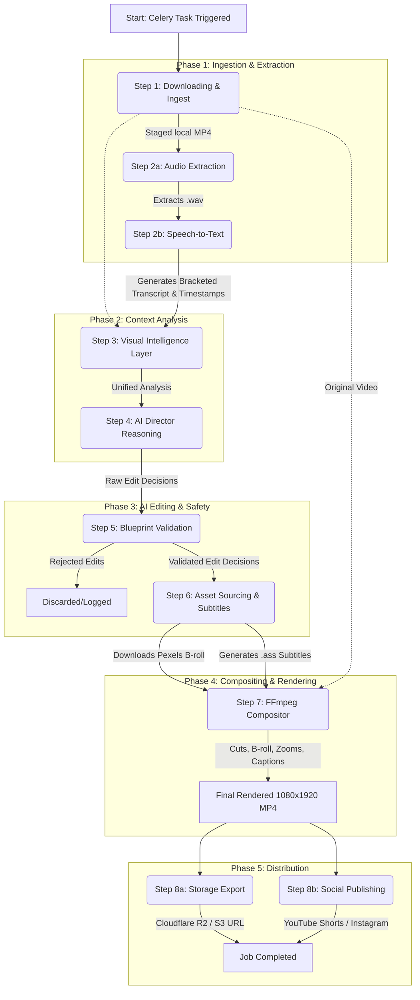

# Full Video Processing Pipeline

Here is the complete, step-by-step breakdown of how a video is processed in the Ai Content Manager. You can use this flow to create your diagram.

## Visual Flowchart

---

## Detailed Step-by-Step Breakdown

### Step 1: Downloading & Raw Media Ingest
- **Action:** The system receives a `job_id` and fetches the job details from the PostgreSQL database.
- **Process:** It attempts to download the source video from the provided URL (e.g., S3, Cloudflare R2, or a raw HTTP stream) and saves a local copy called `raw_source.mp4` in a temporary workspace directory.
- **Validation:** Ensures the downloaded file is a valid video file (size > 1KB).

### Step 2: Audio Extraction & Speech-to-Text (Transcribing)
- **2a. Audio Extraction:** Uses FFmpeg (`services.media_extractor`) to strip the audio track from `raw_source.mp4` and converts it to a 16kHz, mono, 16-bit PCM `.wav` file.
- **2b. Transcription:** Uses `faster-whisper` (`services.transcriber`) to transcribe the audio. It detects precise word-level timestamps and chunks the text logically based on punctuation and silence gaps (>0.8s). It outputs a compressed "bracketed transcript".

### Step 3: Visual Intelligence Layer (Visual Analysis)
- **Action:** The system analyzes the visual context of the original video (`services.visual_analysis`).
- **Process:** It extracts scenes, detects subjects, and maps out "safe regions" (areas where text/graphics won't cover faces).
- **Output:** It combines the transcript from Step 2 with this visual data to create a `UnifiedAnalysis` object.

### Step 4: AI Director Reasoning
- **Action:** The "Brain" of the operation (`services.ai_director`).
- **Process:** Sends the `UnifiedAnalysis` to the LLM (Google Gemini 3.6 Flash). The LLM acts as a video editor and decides where to make cuts, add B-roll, or apply zoom effects.
- **Output:** Returns a structured JSON Edit Decision List (EDL).

### Step 5: Blueprint Validation (Guardrails)
- **Action:** A deterministic safety layer (`services.blueprint_validator`).
- **Process:** Intercepts the AI's edit decisions to ensure they don't break the rules (e.g., B-roll budgets, overlapping edits, impossible timestamps). 
- **Output:** Filters out bad decisions and produces a **Validated Edit List**.

### Step 6: Asset Sourcing & Dynamic Subtitles
- **6a. Asset Sourcing:** The `asset_manager` reads the validated B-roll requests, queries the Pexels Video API, and downloads relevant portrait-mode video clips to a local `assets/` folder.
- **6b. Subtitles:** The `subtitle_generator` takes the precise timestamp map from Step 2 and generates an Advanced SubStation Alpha (`.ass`) file, applying "TikTok-style" yellow word-by-word highlighting.

### Step 7: FFmpeg Video Compositing (Rendering)
- **Action:** The heavy lifting (`services.compositor`).
- **Process:** Uses FFmpeg to chop up the original video based on the Validated Edit List. It applies scale/crop filters for zooms, replaces video segments with the downloaded B-roll (while preserving the original audio), and burns the `.ass` subtitles directly into the video frames.
- **Output:** A final, composited 1080x1920 MP4 file (`final_rendered.mp4`).

### Step 8: Storage Export & Social Publishing
- **8a. Storage:** The `publisher` service uploads the `final_rendered.mp4` back to cloud storage (Cloudflare R2 or S3), securing a public streaming URL.
- **8b. Social:** Optionally pushes the video directly to YouTube Shorts or Instagram Reels via their respective Graph APIs.
- **Final:** The database is updated, setting the job status to `COMPLETED`. The temporary workspace is deleted.
